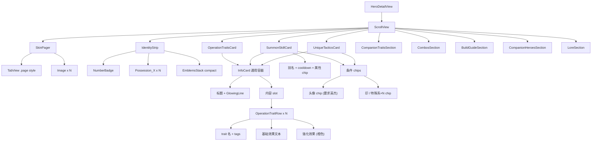

# 英杰详情页 设计稿

> 配套文档：[HeroDetailPage_PRD.md](./HeroDetailPage_PRD.md)。本文档负责把 PRD 的"做什么"翻译成 SwiftUI 可直接落地的"长什么样、什么尺寸、用什么组件"。

## 1. 全局视觉令牌

| Token | 取值 | 来源 |
| --- | --- | --- |
| 主字体 | `KaiTi_GB2312`（楷体） | [HeroFont.swift](../FozzaNimbleList/Develop/Foundation/HeroFont.swift) |
| 大字号 | `.largeTitle`（32） | 仅 navigationTitle 备用 |
| 卡片标题 | `.H2`（20）+ bold | `Font.hero_Font(.H2, weight: .bold)` |
| 副标题 / trait 名 | `.Headline`（16）+ semibold | `Font.hero_Font(.Headline, weight: .semibold)` |
| 正文 | `.P1`（14） | `Font.hero_Font(.P1)` |
| chip 文字 | `.smallText1`（11） | 同 EmblemButton |
| 主色（深蓝） | `#0F4F8A` 渐变 | 复用 [EmblemButton.swift](../FozzaNimbleList/Develop/BaseUIKit/EmblemButton.swift) 的金属感 |
| 强化高亮 | 系统 `.orange` | 表示"強化版"，与基础效果区分 |
| 分隔线 | `GlowingLine` 黑色变体 | [GlowingLine.swift](../FozzaNimbleList/Develop/BaseUIKit/GlowingLine.swift) |
| 卡片背景（light） | `.systemBackground` + 1pt `.separator` 描边 | SwiftUI 系统 |
| 卡片背景（dark） | `.secondarySystemBackground` | SwiftUI 系统 |
| 卡片圆角 | 12pt | — |
| 卡片内边距 | 12pt | — |
| 卡片纵向间距 | 12pt | — |

> 颜色全部走 SwiftUI 系统语义色 + 现有渐变令牌，保证暗黑模式自动适配。

## 2. 屏幕线框（ASCII）

按 iPhone 14（390×844）竖屏布局。

```
┌────────────────────────────────────────┐  ← Status Bar 59pt
├────────────────────────────────────────┤
│ ‹ 列表        赵云                 (·) │  L0 44pt nav
├────────────────────────────────────────┤  ↑
│   ╱──────────╲      ╱─────────╲       │  │
│  │            │ ◀ ▶│           │       │  │ 280pt
│  │ Portrait_  │    │  …next    │       │  │ L1 皮肤 pager
│  │  201        │    │  skin…    │       │  │ 单图 220×260
│  │            │    │           │       │  │ 邻图露 20pt 提示
│   ╲──────────╱      ╲─────────╱       │  │
│                                        │  │
│                ● ○ ○                   │  ↓ page dots
├────────────────────────────────────────┤  ↑
│ [#201] [⚒][⚡] [蜀][猛将][五虎][主君]   │  L2 56pt
├────────────────────────────────────────┤  ↑
│ ┌────────────────────────────────────┐ │  │
│ │ ◆ 操作时特性                        │ │  │
│ │ ─────────────────────────          │ │  │
│ │ 忠勇兼備                  [蜀][感電]│ │  │
│ │ 蜀×1→攻击力+5% / 感電で召喚CD-1s   │ │  │ ~220pt
│ │ → [強化] 蜀×1→攻击力+8%            │ │  │
│ │ ─────                              │ │  │
│ │ 光龍神槍                  [雷][感電]│ │  │
│ │ 感電敵に+50% / 1000HIT で無双+50%  │ │  │
│ │ → [強化] バフ中の「雷」+50%扱い     │ │  │
│ └────────────────────────────────────┘ │  ↓
│                                        │
│ ┌────────────────────────────────────┐ │  ↑
│ │ ◆ 召唤技      飛剣・雷  ⏱36s [雷]  │ │  │
│ │ ─────────────────────────          │ │  │ ~150pt
│ │ 前方に雷属性の斬撃を飛ばす          │ │  │
│ │ 強化：弾数                          │ │  │
│ │ 条件：[💁劉備] [⚡雷×10]            │ │  │
│ └────────────────────────────────────┘ │  ↓
│                                        │
│ ┌────────────────────────────────────┐ │  ↑
│ │ ◆ 固有戦法                         │ │  │
│ │ ─────────────────────────          │ │  │ ~140pt
│ │ 召喚技「飛剣」の攻撃力 +100%        │ │  │
│ │ → [強化] +120%                     │ │  │
│ │ 条件：[💁諸葛亮] [⚒技×5]            │ │  │
│ └────────────────────────────────────┘ │  ↓
│                                        │
│ ⌄ ☆随行时特性（默认展开）              │  L4 折叠区
│ ⌄ 攻撃 motion（点击展开）              │
│ ⌄ 推奨ビルド（点击展开）                │
│ ⌄ ☆相性が良い随行武将（点击展开）       │
│                                        │
│ ── 英傑考察 ──                          │  L5
│ 真・三國無双シリーズでは…                │
│                                        │
└────────────────────────────────────────┘  ↓ Tab Bar 83pt
```

> 实际间距以代码 padding 为准，ASCII 仅示意层次。

## 3. 组件树（Mermaid）



## 4. 复用 vs 新建组件清单

### 4.1 直接复用（不动）

| 组件 | 文件 | 用途 |
| --- | --- | --- |
| `Font.hero_Font` | [HeroFont.swift](../FozzaNimbleList/Develop/Foundation/HeroFont.swift) | 全部文字 |
| `EmblemButton` | [EmblemButton.swift](../FozzaNimbleList/Develop/BaseUIKit/EmblemButton.swift) | 特殊系 chip（默认尺寸） |
| `EmblemsStack` | [EmblemsStack.swift](../FozzaNimbleList/Develop/HeroList/HeroCell/EmblemsStack.swift) | 多 chip 横排 + chunk |
| `GlowingLine` | [GlowingLine.swift](../FozzaNimbleList/Develop/BaseUIKit/GlowingLine.swift) | 卡片标题下分隔 |
| `ImageResouceManager` | [ImageResouceManager.swift](../FozzaNimbleList/Develop/Utils/ImageResouceManager.swift) | Possession_X 资源名映射 |
| `HeroTitle` | [HeroTitle.swift](../FozzaNimbleList/Develop/HeroDetail/Components/HeroTitle.swift) | （v1.0 因 navigationTitle 取代，可不用） |

### 4.2 新建组件（在 [`FozzaNimbleList/Develop/HeroDetail/Components/`](../FozzaNimbleList/Develop/HeroDetail/Components/) 下）

| 组件 | 接口（草稿） | 说明 |
| --- | --- | --- |
| `SkinPager` | `init(images: [String])` | TabView .page 风格，单图时隐藏 dots |
| `IdentityStrip` | `init(hero: HeroModel)` | L2 整体条 |
| `NumberBadge` | `init(number: Int)` | `#201` 胶囊徽章 |
| `EmblemButtonCompact` | `init(title: String, isLimitBreak: Bool = false)` | EmblemButton 的 16pt 紧凑变体；limitBreak=true 时套虚线方框 |
| `InfoCard<Content: View>` | `init(title: String, @ViewBuilder content: () -> Content)` | 通用卡片容器 |
| `OperationTraitsCard` | `init(traits: [OperationTrait])` | 渲染 N 条 trait |
| `OperationTraitRow` | `init(trait: OperationTrait)` | 单条 trait |
| `SummonSkillCard` | `init(skill: SummonSkill)` | 含 cooldown / 强化条件 |
| `UniqueTacticsCard` | `init(tactics: UniqueTactics?)` | nil 时显示"暂未录入" |
| `ConditionChips` | `init(condition: ActivationCondition)` | 把英杰头像 / 印×N / 特殊系×N 一行渲染 |
| `HeroChip` | `init(hero: MusouHero)` | 头像 + 名字小胶囊，可点跳转（v1.0 stub） |
| `EmblemCountChip` | `init(emblem: EmblemType, count: Int)` 或 `init(possession: PossessionsType, count: Int)` | "雷×10" / "猛将×7" |
| `ElementBadge` | `init(element: PossessionsType)` | 召唤技属性徽章，按属性变色 |
| `CooldownLabel` | `init(seconds: Int)` | ⏱36s |
| `CompanionTraitsTable` | `init(traits: [CompanionTrait])` | 3 行表格 |
| `CollapsibleSection` | `init(title: String, defaultExpanded: Bool, content: ...)` | 基于 `DisclosureGroup` 的样式包装 |
| `LoreSection` | `init(lore: Lore)` | 简单段落渲染 |

> 命名遵循现有约定（`XxxCard / XxxRow / XxxChip`）。所有新组件都放 `HeroDetail/Components/` 目录下。

## 5. 关键 UI 细节

### 5.1 SkinPager 行为

```
单图模式（v1.0 默认）：
- TabView 仅一个 page
- 隐藏 PageControl
- 不响应横滑（避免误触提示空 page）

多图模式（v2.0+）：
- TabView .page(indexDisplayMode: .always)
- 相邻 page 默认露 20pt 边缘（通过 frame width: UIScreen.width - 40 实现）
- 切换时无 spring 动画，避免与父 ScrollView 嵌套抖动
```

### 5.2 IdentityStrip 布局

```
HStack(spacing: 8) {
    NumberBadge(number: hero.number.rawValue)
    ForEach(hero.possessions) { Image(possession asset, 22x22) }
    Divider().frame(height: 16)
    EmblemsStack.compact(emblems: hero.emblems)
}
.padding(.horizontal, 16)
.frame(height: 56)
```

如果 emblems 超 4 个：把超出部分折叠成 `+N` chip，点击展开全部（v1.0 可先不做折叠，先直接全显示，让 EmblemsStack 自然换行）。

### 5.3 InfoCard 容器

```
VStack(alignment: .leading, spacing: 8) {
    HStack {
        Rectangle().fill(主色).frame(width: 4, height: 18)
        Text(title).font(.hero_Font(.H2, weight: .bold))
        Spacer()
    }
    GlowingLine(color: .black).frame(height: 1)
    content
}
.padding(12)
.background(.systemBackground)
.overlay(RoundedRectangle(cornerRadius: 12).stroke(.separator, lineWidth: 1))
.cornerRadius(12)
.padding(.horizontal, 16)
```

### 5.4 OperationTraitRow 排版

```
VStack(alignment: .leading, spacing: 4) {
    HStack {
        Text(trait.name).font(.hero_Font(.Headline, weight: .semibold))
        Spacer()
        ForEach(trait.tags) { TagChip(text: $0) }
    }
    Text(trait.baseEffect).font(.hero_Font(.P1))
    if let s = trait.strengthenedEffect {
        HStack(alignment: .top, spacing: 6) {
            Text("→ [強化]").foregroundColor(.orange).font(.hero_Font(.P2, weight: .semibold))
            Text(s).foregroundColor(.orange).font(.hero_Font(.P1))
        }
    }
}
```

多条 trait 之间用 `Divider().padding(.vertical, 4)` 分隔。

### 5.5 ElementBadge 配色表

| 属性 | 主色 | 备注 |
| --- | --- | --- |
| `fire` 炎 | `.orange` | — |
| `ice` 冰 | `.cyan` | — |
| `thunder` 雷 | `.yellow`（深底用 `.purple`） | — |
| `wind` 风 | `.green` | — |
| `slash` 斬 | `.gray` | — |
| 其他（力/智等非属性） | 系统次要色 | 仅作 chip 区分 |

### 5.6 ConditionChips 行为

```
HStack(spacing: 6) {
    ForEach(condition.requiredHeroes ?? []) { HeroChip(...) }
    ForEach(condition.requiredAttributeDict ?? [:]) { EmblemCountChip(possession: $0.key, count: Int($0.value)) }
    ForEach(condition.requiredEmblemTypeDict ?? [:]) { EmblemCountChip(emblem: $0.key, count: Int($0.value)) }
}
.flexibleWrap()    // 如果太长就换行
```

`flexibleWrap()` 用第三方 FlowLayout 实现，或简单 `LazyVGrid` 替代。

### 5.7 CollapsibleSection 样式

复用 `DisclosureGroup`，但样式覆盖：
- 箭头改成楷体的 `▼ / ▶`
- 标题使用 `.H3` semibold
- 展开时正文与标题对齐缩进 0pt（不缩进，让内容占满宽度）

### 5.8 暗黑模式

所有颜色采用语义色：
- 卡片背景：`Color(.systemBackground)` / `Color(.secondarySystemBackground)`
- 主文本：`Color.primary`
- 次要文本：`Color.secondary`
- 强化高亮：`Color.orange`（在暗模式下也能保持高对比）

不能写死 `Color.white` / `Color.black`。

## 6. 尺寸与间距速查

| 区域 | 尺寸 |
| --- | --- |
| Nav bar | 44pt（系统） |
| L1 SkinPager 总高 | 280pt |
| L1 单图 | 220×260pt |
| L2 IdentityStrip | 56pt |
| L3 卡片间距 | 12pt 纵向 |
| L3 卡片左右 padding | 16pt（贴页边） |
| L3 卡片内部 padding | 12pt |
| InfoCard 标题左侧装饰条 | 4×18pt |
| Possession 图标 | 22×22pt |
| EmblemButton 默认 | 100×12pt（原始） |
| EmblemButtonCompact | 80×16pt（新增） |
| HeroChip 头像 | 18×18pt 圆形 |

## 7. 资源清单

| 资源 | 状态 | 说明 |
| --- | --- | --- |
| `Portrait_201` | ✓ 已有 | 赵云立绘 |
| `Avatar_201` | ✓ 已有 | 赵云头像（HeroChip 用） |
| `Possession_4`（技） / `Possession_13`（雷） | ✓ 已有 | 印图标 |
| `Portrait_default` | ⬜ 待新增 | 缺图兜底 |
| 各属性 chip 背景渐变 | ⬜ 待新增 | 复制 EmblemButton 的渐变方案，按属性换色 |

## 8. 实现优先级（v1.0 落地排期建议）

1. **P0**：`InfoCard`、`IdentityStrip`、`OperationTraitsCard`、`SummonSkillCard`、`UniqueTacticsCard`、`HeroDetailView` 重排（PRD §6 验收 1–5）
2. **P0**：模型演进 + `CharactersBundleLoader`（[PRD §5.2 / §5.3](./HeroDetailPage_PRD.md#52-数据模型缺口待后续-pr-处理)）
3. **P1**：`SkinPager`（单图模式）、`CompanionTraitsTable`、`CollapsibleSection`
4. **P2**：`CombosSection`、`BuildGuideSection`、`CompanionHeroesSection`、`LoreSection`
5. **P3**：暗黑模式细调、`EmblemButtonCompact` 限界突破样式

## 9. Open Questions

| # | 问题 | 当前默认 | 决策方 |
| --- | --- | --- | --- |
| 1 | L2 身份条要不要保留中文名 + 日文名双语？ | v1.0 仅中文 | 后续决定 |
| 2 | ConditionChips 里的"英杰要求"是否要支持点击跳转到目标武将详情？ | v1.0 仅显示，不可点 | v2.0 实现 |
| 3 | 折叠 section 的展开状态是否需要 persist？ | v1.0 不持久化 | 用户反馈后定 |
| 4 | 攻击 motion 是否考虑短视频/GIF？ | 仅文字 | 远期资源到位再说 |
