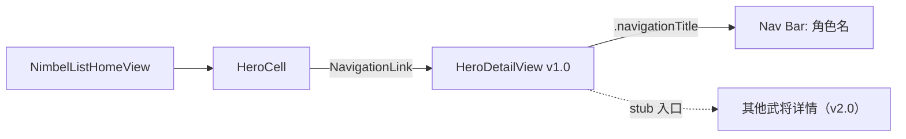

# 英杰详情页 PRD

| 项目 | 信息 |
| --- | --- |
| 版本 | v1.0（首版） |
| 作者 | Cursor Agent（基于用户需求 + wiki 数据） |
| 关联设计稿 | [HeroDetailPage_DesignSpec.md](./HeroDetailPage_DesignSpec.md) |
| 关联数据资产 | [FozzaNimbleList/Data/Characters/](../FozzaNimbleList/Data/Characters/) |
| 样本武将 | 赵云 #201（[zhaoyun.json](../FozzaNimbleList/Data/Characters/zhaoyun.json) / [zhaoyun.md](../FozzaNimbleList/Data/Characters/zhaoyun.md)） |
| 当前实现 | [FozzaNimbleList/Develop/HeroDetail/HeroDetailView.swift](../FozzaNimbleList/Develop/HeroDetail/HeroDetailView.swift) |

## 1. 背景与目标

### 1.1 背景
项目 `FozzaNimbleList` 是无双 ABYSS（無双アビス）游戏的英杰数据查阅工具。现有列表页 [NimbelListHomeView.swift](../FozzaNimbleList/Develop/HeroList/NimbelListHomeView.swift) 已经能按势力 section 展示武将卡片，每张卡片显示头像、名称、印记、特殊系等基础信息。

### 1.2 当前痛点
现有的详情页 [HeroDetailView.swift](../FozzaNimbleList/Develop/HeroDetail/HeroDetailView.swift) 是占位实现：

```
ScrollView
  ├ HeroTitle（名称 + 分隔线）
  ├ Portrait 大图（200×400pt）  ← 占去首屏一大半空间
  ├ Text("召唤技: ...")          ← 简陋
  └ Text("固有战法: ...")        ← 简陋
```

问题：
1. **空间分配不合理**：portrait 把首屏吃完，关键信息（印记、属性、操作时特性、召唤技、固有战法）被挤到滚动后才出现。
2. **缺乏皮肤切换入口**：用户期望未来能横滑切换不同皮肤。
3. **信息密度不足且结构扁平**：所有内容堆成几行 `Text`，没有视觉分层。
4. **数据承载力不够**：[HeroModel.swift](../FozzaNimbleList/Develop/Model/HeroModel.swift) 把 `summonSkill / uniqueTactics / playerHeroTrait` 都建模为单 String，**承载不了** wiki 上"赵云有 2 条操作时特性、3 条随行时特性 + 各自激活条件"的真实数据。

### 1.3 目标
- 在保留"皮肤可横滑"概念的前提下，**收缩 portrait 尺寸**，让首屏能同时呈现：身份条 + 操作时特性卡。
- 设计可复用的信息卡组件，统一承载操作时特性 / 召唤技 / 固有战法 / 随行时特性。
- 为下面要做的"模型演进 PR"明确字段缺口和迁移路径。

### 1.4 非目标（v1.0 不做）
- 编辑、收藏、分享、@提及等社交/写功能
- 多皮肤资源（仍用现有 `Portrait_201` 占位，但代码架构按 N 张皮肤设计）
- 跳转到其他武将的二级详情（推荐英杰列表只 stub 入口）
- 横屏适配（仅做竖屏 iPhone）

---

## 2. 用户场景与流程

### 2.1 用户画像
- **核心用户**：无双 ABYSS 玩家，关心 build 搭配
- **次级用户**：游戏内容创作者 / 攻略爱好者

### 2.2 主要使用场景
1. 玩家从列表 cell 点入 → 想确认这个武将有什么印 / 强化什么属性 → 不希望滚动就能看到
2. 玩家在思考 build → 想看操作时特性 / 召唤技 / 固有战法 的具体效果与强化条件
3. 玩家想深读 → 滚动查看攻击 motion、推荐 build、相性武将、英傑考察

### 2.3 入口与跳转



---

## 3. 信息架构

按"首屏可见 → 滚动可见"分 6 层：

| 层 | 区域 | 高度 | 内容 | 数据源 |
| --- | --- | --- | --- | --- |
| L0 | 导航栏 | 44pt | 角色名（`navigationTitle`） | `HeroModel.name` |
| L1 | 皮肤 pager | 280pt | 横滑 portrait + page dots | `HeroModel.portraitImageName` + 未来的 skins 数组 |
| L2 | 身份条 | 56pt | 编号徽章 + 印记小图标 + emblems chips | `HeroModel.number / possessions / emblems` |
| L3 | 关键信息卡 ×3 | 480pt（首屏滚动可见） | 操作时特性 + 召唤技 + 固有战法 | 扩展自 [zhaoyun.json](../FozzaNimbleList/Data/Characters/zhaoyun.json) |
| L4 | 次要信息区 | 不限 | 随行时特性表、攻击 motion 摘要、推荐 build、相性武将 | zhaoyun.json 扩展字段 |
| L5 | 英傑考察 + 底部 | 不限 | 背景设定文字 + （stub）相关武将入口 | zhaoyun.md |

### 3.1 首屏可见度
按 iPhone 14（844pt）减去 status bar（59pt）+ nav bar（44pt）+ tab bar（83pt）= **可视区约 658pt**。

```
44pt   L0 nav
280pt  L1 portrait pager
 56pt  L2 身份条
————— 380pt 累计，剩余 278pt
220pt  L3 操作时特性卡（赵云 2 条 trait）  ← 完整可见
————— 600pt 累计，剩余  58pt
 ~       L3 召唤技卡部分露头 → 引导上滑
```

### 3.2 数据来源映射

| 详情页字段 | HeroModel | Characters/<hero>.json |
| --- | --- | --- |
| L0 角色名 | `name` ✓ | `meta.name` |
| L1 portrait | `portraitImageName` ✓ | （未来扩展 `meta.skins[]`） |
| L2 编号 | `number.rawValue` ✓ | `meta.number` |
| L2 印记图标 | `possessions[]` ✓ | `possessions.base` + `possessions.limitBreak` |
| L2 特殊系 chips | `emblems[]` ✓ | `emblems.base` + `emblems.limitBreak` |
| L3 操作时特性 | `playerHeroTrait` ❌（仅单 String） | `operationTraits[]` ✓ |
| L3 召唤技 | `summonSkill` ❌（仅单 String） | `summonSkill` 对象 ✓ |
| L3 固有战法 | `uniqueTactics` ❌（仅单 String） | `uniqueTactics` 对象 ✓ |
| L4 随行时特性 | 缺字段 ❌ | `companionTraits[]` ✓ |
| L4 攻击 motion | 缺字段 ❌ | `combos` ✓ |
| L4 推荐 build | 缺字段 ❌ | `recommendedBuild` ✓ |
| L4 相性武将 | 缺字段 ❌ | `companionRecommendations[]` ✓ |
| L5 英傑考察 | 缺字段 ❌ | `lore` + `zhaoyun.md` 长文 |

**结论**：v1.0 详情页需要"模型演进 + 数据加载层"才能完整跑起来。详见 §5。

---

## 4. 功能规格

### 4.1 L0 导航栏
- 标题：`hero.name`
- 显示模式：`.inline`
- 右上角：v1.0 留白（v2 预留收藏图标位）
- 返回按钮：默认 SwiftUI 实现

### 4.2 L1 皮肤 pager
- 形态：`TabView` 的 `.page(indexDisplayMode: .automatic)` 风格
- 单图尺寸：220×260pt（与原来的 200×400 相比，**高度收缩 35%**，让出 L2/L3 空间）
- 居中布局，左右各留约 20pt 让相邻皮肤露出边缘（提示可滑）
- Page Dots：自动渲染在底部
- 单皮肤时：隐藏 Page Dots，TabView 退化为静态 Image
- 数据：`hero.skins` 数组（v1.0 实际只用 `[hero.portraitImageName]` 单元素）
- 资源缺失兜底：显示 `Portrait_default`（待新增）或半透明灰底 + "尚未配图"

### 4.3 L2 身份条
布局：左 → 右 横排
1. 编号徽章 `#201`：等宽数字 + 楷体，圆角胶囊
2. 印记小图标：每图 22×22pt，最多 4 个，超出 `…` 折叠
3. emblems chips：复用 [EmblemButton.swift](../FozzaNimbleList/Develop/BaseUIKit/EmblemButton.swift)，建议增加 **compact 变体**（高 16pt）
4. **限界突破获得的 印 / chips 用方框 + 半透明** 区分（来自 `possessions.limitBreak`）

### 4.4 L3 关键信息卡

每张卡共通结构：

```
┌──────────────────────────────────┐
│ ◆ <卡片标题>                       │   <- 楷体 H2，带左侧 4pt 装饰
│ ─── GlowingLine ───              │   <- 复用 GlowingLine.swift
│  <内容 slot>                      │
└──────────────────────────────────┘
```

#### 卡片 1：操作时特性
- 渲染 `operationTraits[]` 的每一条为一个 `OperationTraitRow`
- 每条结构：
  - 顶部：trait 名（粗体）+ tags
  - 第二行：基础效果（正文）
  - 第三行（如有）：强化效果（用 `→ [強化]` 前缀 + 高亮色）
- 赵云示例：渲染 2 条（忠勇兼備 / 光龍神槍）

#### 卡片 2：召唤技
- Header：技名 + ⏱cooldownSec + 属性 chip（雷属性用蓝紫，炎用红橙等）
- Body：`effect` 文本
- Footer：**强化项目** + **强化条件**
  - 强化条件按"英杰头像 + 印×N"chip 形式
  - 赵云示例："弾数" + 头像[刘备] + chip[雷×10]

#### 卡片 3：固有战法
- 与召唤技类似，但无 cooldown
- 包含基础 / 强化两段效果 + 激活条件 chips
- 赵云示例：效果 +100% → +120%，激活条件 = 諸葛亮 + 技×5

### 4.5 L4 次要信息区
按以下顺序，**默认折叠**（仅显示标题 + 展开按钮）：

1. ☆随行时特性（默认展开，因为是关键信息）
2. 攻击 motion 摘要（默认折叠）
3. 推荐 build（默认折叠）
4. ☆相性が良い随行武将（默认折叠）

折叠组件：复用 SwiftUI `DisclosureGroup`。

### 4.6 L5 英傑考察
- 渲染 `lore.summary` + `lore.details[]`
- 仅文字段落，不可编辑
- 内联超链接保留为 wikiwiki 蓝色文字（v1.0 链接不可点）

---

## 5. 状态、边界与数据缺口

### 5.1 状态表

| 状态 | 触发 | UI 表现 |
| --- | --- | --- |
| 正常加载 | 数据齐全 | 渲染全部 L1–L5 |
| portrait 资源缺失 | `UIImage(named:)` 返回 nil | L1 显示默认占位图 + 文字 "尚未配图" |
| 操作时特性数组为空 | `operationTraits.isEmpty` | 隐藏整张卡片（避免空卡） |
| 召喚技 / 固有战法字段缺失 | 字段值为 nil | 卡片标题保留，body 显示 "暂未录入" 灰色文案 |
| 随行时特性 < 3 条 | 数据缺失 | 保留表头，缺失行显示 "—" |
| 单皮肤 | `skins.count == 1` | 隐藏 page dots |

### 5.2 数据模型缺口（待后续 PR 处理）

当前 [HeroModel.swift](../FozzaNimbleList/Develop/Model/HeroModel.swift) 与 v1.0 UI 不匹配。建议的演进方向：

```swift
public struct HeroModel: Codable, Identifiable, Sendable {
    // 不变字段
    var number: MusouHero
    var name: String
    var possessions: [PossessionsType]
    var emblems: [EmblemType]
    var mainEmblem: EmblemType

    // —— 演进 ——
    var operationTraits: [OperationTrait]   // 替换 playerHeroTrait: String
    var summonSkill: SummonSkill            // 替换 summonSkill: String
    var uniqueTactics: UniqueTactics?       // 替换 uniqueTactics: String
    var companionTraits: [CompanionTrait]   // 新增
    var skins: [String]                     // 新增，皮肤图名数组
    var japaneseName: String?               // 新增
    var voiceActor: String?                 // 新增
}

struct OperationTrait: Codable {
    var name: String
    var baseEffect: String
    var strengthenedEffect: String?
    var tags: [String]
}

struct SummonSkill: Codable {
    var name: String
    var element: PossessionsType            // 复用现有属性枚举
    var effect: String
    var cooldownSec: Int
    var upgradeItem: String?
    var upgradeCondition: ActivationCondition?
}

struct UniqueTactics: Codable {
    var name: String?
    var baseEffect: String
    var strengthenedEffect: String?
    var activationCondition: ActivationCondition
}

struct CompanionTrait: Codable {
    var index: Int                          // 1 / 2 / 3
    var trait: String
    var activationCondition: ActivationCondition?
}
```

> `ActivationCondition` 复用 [ActivationCondition.swift](../FozzaNimbleList/Develop/HeroDefines/ActivationCondition.swift) 现有结构。

对应 DB 层也需要演进 [HeroEntities.swift](../FozzaNimbleList/Develop/Database/HeroEntities.swift) 和 [HeroRepository.swift](../FozzaNimbleList/Develop/Database/HeroRepository.swift)：新增 `hero_operation_trait` / `hero_summon_skill` / `hero_unique_tactics` / `hero_companion_trait` 表。

### 5.3 数据加载层（建议方案）

新增 `CharactersBundleLoader`：扫描 `Bundle.main` 下 `Data/Characters/*.json` 并解码为上述演进版 `HeroModel`。优势：
- 与现有 `HeroJSONLoader` 风格一致
- 不需要立即上 server，App 离线可用
- 后续若要接 server，只换 loader 实现，UI 不动

---

## 6. 验收标准

| # | 标准 |
| --- | --- |
| 1 | 进入赵云详情页，首屏（无滚动）能同时看到：角色名、皮肤大图、印记、特殊系、操作时特性卡完整内容 |
| 2 | 横滑 portrait pager 时（v1.0 只有 1 张图）不会崩溃，page dots 不显示 |
| 3 | 操作时特性卡正确渲染 2 条 trait，每条都有"基础 → 强化"两行 |
| 4 | 召唤技卡显示 `飛剣・雷 / ⏱36s / 雷` 头部，effect 文本和强化条件齐全 |
| 5 | 固有战法卡显示 `+100% → +120%` 效果和 `諸葛亮 + 技×5` 激活条件 |
| 6 | 滚动后能看到随行时特性 3 行表、攻击 motion 摘要、推荐 build 表 |
| 7 | 暗黑模式下所有卡片、字体、chip 颜色对比度足够 |
| 8 | 跟列表页风格统一（楷体、蓝灰金属感 chip、GlowingLine） |
| 9 | 没有 portrait 资源的武将（其他武将）能 fallback 到占位图 |
| 10 | 字段缺失时不显示空卡 / 不崩溃 |

---

## 7. 里程碑

| 里程碑 | 内容 | 状态 |
| --- | --- | --- |
| M0 | 沉淀赵云数据（json + md + README） | ✓ 本次 PR |
| M0 | PRD + 设计稿 | ✓ 本次 PR |
| M1 | `HeroModel` 字段演进 + DB schema 演进 | 下一 PR |
| M2 | `CharactersBundleLoader` + Repository 适配 | 下一 PR |
| M3 | 新 `HeroDetailView` 实现（按设计稿） | 下一 PR |
| M4 | 沉淀其余 5–10 位主力武将的 json/md | 持续迭代 |
| M5 | server 化 + 评论 / 收藏（v2.0） | 远期 |

---

## 8. 风险

| 风险 | 影响 | 缓解 |
| --- | --- | --- |
| 资料不齐 | 详情页大面积"暂未录入" | 模型字段全部可选；UI 层做完整 nil 兜底 |
| 多皮肤资源缺失 | pager 视觉单调 | v1.0 用单图占位 |
| 模型演进破坏 mock 数据 | App 启动崩溃 | `HeroRepository.seedFromMockIfNeeded` 升级时同步 mock 数据；提供向下兼容的 init |
| 词条本地化（日/中/英）滞后 | i18n 不一致 | 长文本仅日文优先，后续逐步迁移到 `Localizable.xcstrings` |
